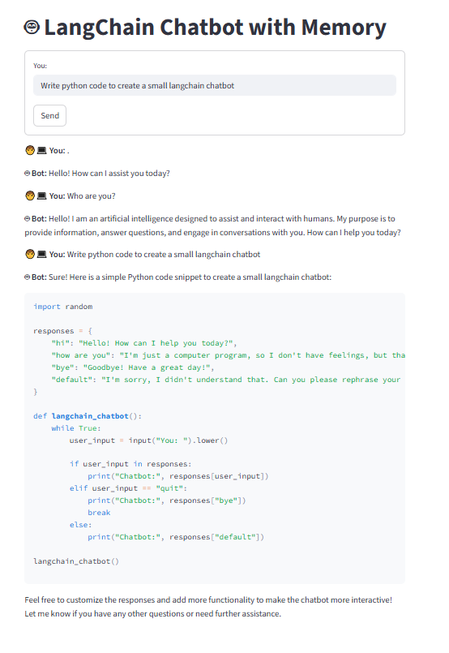

# langchain_chatbot
This chatbot is built using LangChain, Streamlit, OpenAI LLM (API Key)

VSK - Virtual Environment path
`E:\Py_Virtual_Environments\langchain_env\Scripts\activate.bat`

# Command to run the chatbot
`streamlit run app.py`

